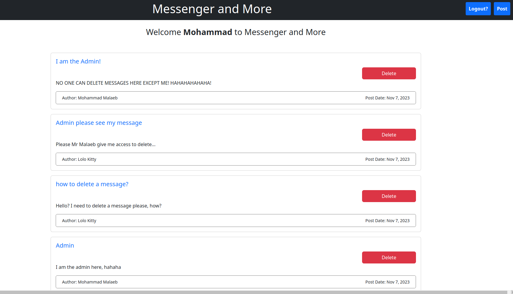
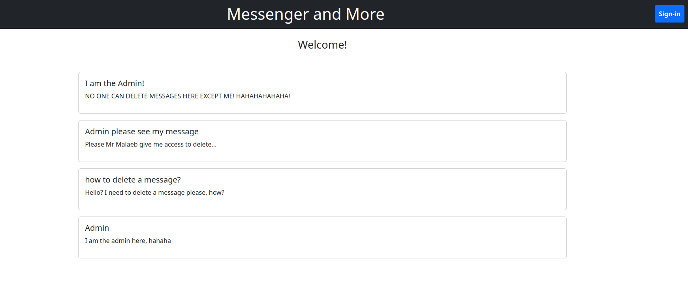
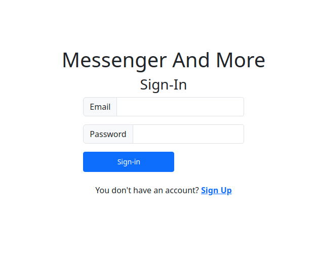

# Members Only Clubhouse

## [Live Preview](https://members-only-platform-production.up.railway.app/)

Members Only Clubhouse is a web application that provides a platform for members to write and read anonymous posts. Inside the clubhouse, members can see the author of a post, but outside viewers can only see the story and wonder who wrote it. This project uses Passport (local strategy) for authentication and Bcrypt for password hashing. The members are asked to provide invitation key once signed up, which is required, then transferred to another page asking for admin password, which is not required and there is a link to proceed to the main page.





## Features

- User authentication using Passport.js
- Anonymous post creation and viewing
- User-friendly interface for reading and writing posts
- Password hashing using Bcrypt for enhanced security
- Ability to delete posts by admins only.

## Technologies Used

- Node.js
- Express
- Passport.js
- Bcrypt
- MongoDB
- Pug
- Bootstrap

## Installation

1. Clone the repository:

   ```bash
   git clone git@github.com:Mo-21/Members-Only-Platform.git

   ```

2. Navigate to the project directory:

   ```bash
   cd Members-Only-Platform

   ```

3. Install dependencies:

   ```bash
   npm install
   ```

## Configuration

1. Create a .env file in the project root with the following variables:

   ```bash
   MONGODB_URI=your-mongodb-link
   ```

2. Start the project:

   ```bash
   npm run serverstart
   ```

   Happy anonymous posting!
